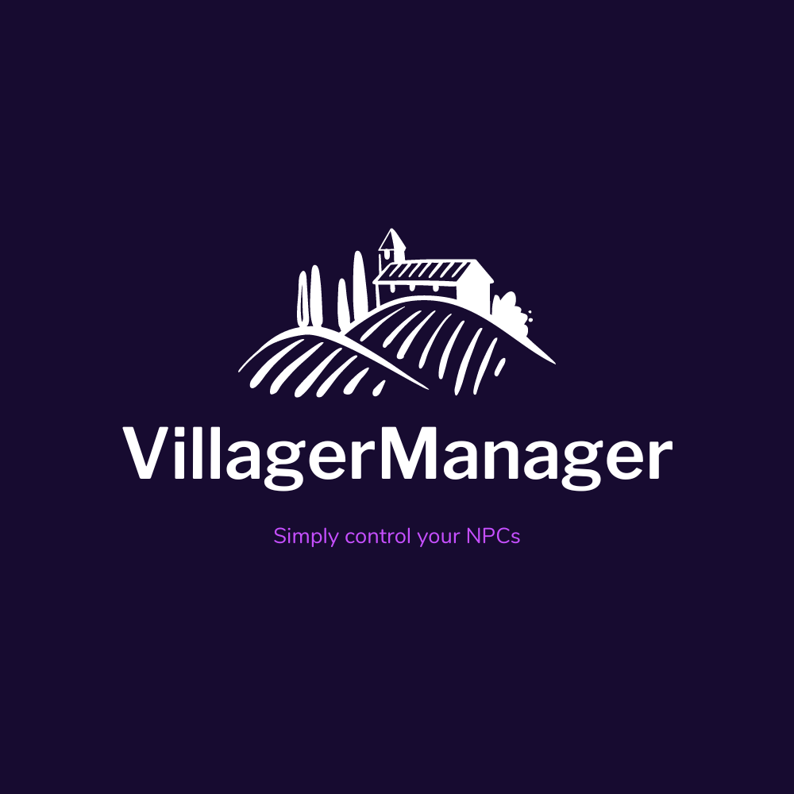
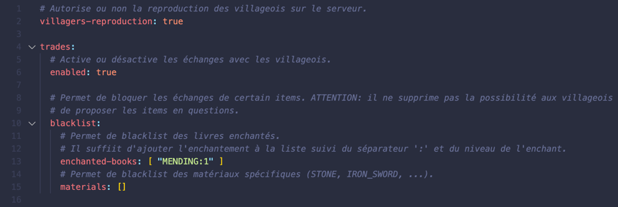

<h1 align="center">
  <a href="https://github.com/LudovicAns/VillagerManager"></a>
  <br>
</h1>

<h4 align="center">Manage villagers on your minecraft server.</h4>


<p align="center">
  <a href="#key-features">Key Features</a> •
  <a href="#how-to-use">How To Use</a> •
  <a href="#download">Download</a> •
  <a href="#credits">Credits</a> •
  <a href="#related">Related</a> •
  <a href="#license">License</a>
</p>




## Key Features

* Block villager reproduction.
* Manage villager trades.
  * Turn on/off trades.
  * Blacklist enchanted book and materials

## How To Use

For now, only one command is available to reload your configurations.

```
/vm reload
```
```
/vm reload <file>
```

## Download

You can [download](https://github.com/LudovicAns/VillagerManager/releases/download/v1.1.0/VillagerManager-1.1.0.jar) latest version or
download [specific version](https://github.com/LudovicAns/VillagerManager/releases).

## Credits

This plugin uses the following open source packages:

- [LansLib](https://github.com/LudovicAns/LansLib)

## License

MIT

---

> GitHub [@LudovicAns](https://github.com/ludovicans)
